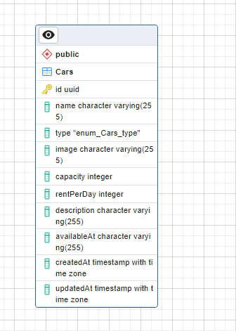

# Binar: Challenge 04

Welcome to my Binar Challenge chapter 3 about create Resful Api Using Express.js .

## Tech stack

- [`Node Js (v18.17.1)`](https://nodejs.org/en)

  > As an asynchronous event-driven JavaScript runtime, Node.js is designed to build scalable network applications. In the following "hello world" example, many connections can be handled concurrently. Upon each connection, the callback is fired, but if there is no work to be done, Node.js will sleep.

- [`Express Js (Web Server)`](https://expressjs.com/)

  > Express is a minimal and flexible Node.js web application framework that provides a robust set of features for web and mobile applications.

- [`Nodemon`](https://www.npmjs.com/package/nodemon)

  > nodemon is a tool that helps develop Node.js based applications by automatically restarting the node application when file changes in the directory are detected.

- [`Sequelize`](https://sequelize.org/)

  > Sequelize is a modern TypeScript and Node.js ORM for Oracle, Postgres, MySQL, MariaDB, SQLite and SQL Server, and more. Featuring solid transaction support, relations, eager and lazy loading, read replication and more.

## Tools

- [`vsCode (Code Editor)`](https://code.visualstudio.com/)

  > Visual Studio Code is a code editor redefined and optimized for building and debugging modern web and cloud applications.

- [`GIT (Version Control)`](https://git-scm.com/)

  > Git is a free and open source distributed version control system designed to handle everything from small to very large projects with speed and efficiency.

- [`Postman `](https://www.postman.com/)

  > Postman is an API platform for building and using APIs. Postman simplifies each step of the API lifecycle and streamlines collaboration so you can create better APIs—faster.

## Feature

### Tes Ping

> - Open Postman
> - Add Request
> - Choose Method 'GET'
> - Enter URL `http://localhost:8001/`
> - Send Req
> - Result

```JSON
{
    "message": "Ping Successfully"
}
```

### Get all Cars

> this features is to get all data cars via API. How to get that data ?
>
> - Open Postman
> - Add Request
> - Choose Method 'GET'
> - Enter URL `http://localhost:8001/cars`
> - Send Req
> - Result

```JSON
{
    "status": 200,
    "message": [
       {
            "id": "02f4e53d-b996-4481-81e9-36d13036ca70",
            "name": "Ferrari",
            "type": "medium",
            "image": "https://unsplash.com/photos/X16zXcbxU4U",
            "capacity": 2,
            "rentPerDay": 900000,
            "description": "Exotic car from italian",
            "availableAt": "2023-11-20 00:00:00.000 +00:00",
            "createdAt": "2023-10-07T09:10:30.227Z",
            "updatedAt": "2023-10-07T09:10:30.227Z"
        },
        {
            "id": "41c20ada-20c5-457c-ab1a-cd90e7d50891",
            "name": "Lamborghini",
            "type": "medium",
            "image": "https://unsplash.com/photos/X16zXcbxU4U",
            "capacity": 2,
            "rentPerDay": 8500000,
            "description": "Exotic car from italian",
            "availableAt": "2023-11-10 00:00:00.000 +00:00",
            "createdAt": "2023-10-07T09:10:30.227Z",
            "updatedAt": "2023-10-07T09:10:30.227Z"
        },
    ]
}
```

### Detail Car

> this features is to get data cars by id . How to get that data ?
>
> - Open Postman
> - Add Request
> - Choose Method 'GET'
> - Enter URL `http://localhost:8001/cars/:id` example `http://localhost:8001/cars/02f4e53d-b996-4481-81e9-36d13036ca70`
> - Send Req
> - Result

```JSON
{
    "status": 200,
    "message": "success",
    "data": {
            "id": "02f4e53d-b996-4481-81e9-36d13036ca70",
            "name": "Ferrari",
            "type": "medium",
            "image": "https://unsplash.com/photos/X16zXcbxU4U",
            "capacity": 2,
            "rentPerDay": 900000,
            "description": "Exotic car from italian",
            "availableAt": "2023-11-20 00:00:00.000 +00:00",
            "createdAt": "2023-10-07T09:10:30.227Z",
            "updatedAt": "2023-10-07T09:10:30.227Z"
        },
}
```

### Create Car

> this features is to Create new Data car . How to Create new data ?
>
> - Open Postman
> - Add Request
> - Choose Method 'POST'
> - Enter URL `http://localhost:8001/cars`
> - Enter menu `Body` > `raw` & change dropdown `Text` to `JSON`
> - Write Object and should include properties like Code Below :

```JSON
{
            "name": "Lamborghini",
            "type": "small",
            "image": "https://unsplash.com/photos/RzgGMz2kU94",
            "capacity": 2,
            "rentPerDay": 8500000,
            "description": "Exotic car from italian",
            "availableAt": "2023-11-21"
}

```

> - Send Req
> - Result

```JSON
{
    "status": 201,
    "message": "Create success",
    "data": {
        "id": "c1be940d-28bc-4af4-906d-ceb3853cb994",
        "name": "Lamborghini",
        "type": "small",
        "image": "https://unsplash.com/photos/RzgGMz2kU94",
        "capacity": 2,
        "rentPerDay": 8500000,
        "description": "Exotic car from italian",
        "availableAt": "2023-11-21T00:00:00.000Z",
        "updatedAt": "2023-10-08T07:00:02.897Z",
        "createdAt": "2023-10-08T07:00:02.897Z"
    }
}
```

### Update Car

> this features is to get data cars by id . How to update that data ?
>
> - Open Postman
> - Add Request
> - Choose Method 'GET'
> - Enter URL `http://localhost:8001/cars/:id` example `http://localhost:8001/cars/c1be940d-28bc-4af4-906d-ceb3853cb994`
> - Enter menu `Body` > `raw` & change dropdown `Text` to `JSON`
> - Write Properties what u want update and should include properties like Code Below :

```JSON

 You don't need to write the whole thing, just select the properties what you want to update

{
        "name": "Lamborghini",
        "type": "small",
        "image": "https://unsplash.com/photos/RzgGMz2kU94",
        "capacity": 2,
        "rentPerDay": 8500000,
        "description": "Exotic car from italian",
        "availableAt": "2023-11-21"
}

example, i wanna update model and description :

{
    "model" : "Aston Martin",
    "description" : "this is exotic car from England"
}

```

> - Send Req
> - Result

```JSON
{
    "status": 202,
    "message": "Car Updated !",
    "data":{
        "id": "c1be940d-28bc-4af4-906d-ceb3853cb994",
        "name": "Aston Martin",
        "type": "small",
        "image": "https://unsplash.com/photos/RzgGMz2kU94",
        "capacity": 2,
        "rentPerDay": 8500000,
        "description": "this is exotic car from England",
        "availableAt": "2023-11-21T00:00:00.000Z",
        "updatedAt": "2023-10-08T07:00:02.897Z",
        "createdAt": "2023-10-08T07:00:02.897Z"
    }
}
```

### Delete Car

> this features is to delete data cars by id . How to Delete that data ?
>
> - Open Postman
> - Add Request
> - Choose Method 'DELETE'
> - Enter URL `http://localhost:8001/cars/:id` example `http://localhost:8001/cars/3d5e4097-3511-41a3-8c2a-0b4c6ae463d9`
> - Send Req
> - Result

```JSON
{
    "status": 202,
    "message": "Delete Successfully"
}
```

## Command List

### 1. Run server

```terminal
npm run dev
```

### 2. Migrate

```terminal
npm run db:migrate
```

### 3. Undo Migrate

```terminal
npm run db:migrate:undo
```

### 4. Seed

```terminal
npm run db:seed
```

### 5. Undo Seed

```terminal
npm run db:seed:undo
```

## ERD ( Entity Relational Diagram )



## How To Start ?

```
- Open terminal
- Clone https://github.com/novalmahardhika/Binar-FSW1.git
- cd Binar-FSW1
- cd challenge-03
- code .
- open terminal vsCode and write 'npm i or npm install'
- open terminal vsCode and write 'npm run dev'
- next u can hit endpoint using postman with 'features' above
```
