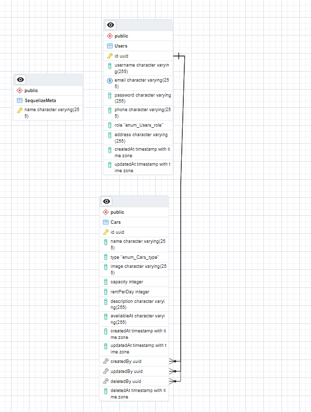

# Binar: Challenge 04

Welcome to my Binar Challenge chapter 5 about create Resful Api Using Express.js .

## Tech stack

- [`Node Js (v18.17.1)`](https://nodejs.org/en)

  > As an asynchronous event-driven JavaScript runtime, Node.js is designed to build scalable network applications. In the following "hello world" example, many connections can be handled concurrently. Upon each connection, the callback is fired, but if there is no work to be done, Node.js will sleep.

- [`Express Js (Web Server)`](https://expressjs.com/)

  > Express is a minimal and flexible Node.js web application framework that provides a robust set of features for web and mobile applications.

- [`Nodemon`](https://www.npmjs.com/package/nodemon)

  > nodemon is a tool that helps develop Node.js based applications by automatically restarting the node application when file changes in the directory are detected.

- [`Sequelize`](https://sequelize.org/)

  > Sequelize is a modern TypeScript and Node.js ORM for Oracle, Postgres, MySQL, MariaDB, SQLite and SQL Server, and more. Featuring solid transaction support, relations, eager and lazy loading, read replication and more.

- [`bcrypt`](https://www.npmjs.com/package/bcrypt)

  > bcrypt is a password-hashing function designed by Niels Provos and David Mazières, based on the Blowfish cipher and presented at USENIX in 1999. Besides incorporating a salt to protect against rainbow table attacks, bcrypt is an adaptive function: over time, the iteration count can be increased to make it slower, so it remains resistant to brute-force search attacks even with increasing computation power.

- [`jsonwebtoken`](https://npmjs.com/package/jsonwebtoken)

  > JSON Web Token (JWT) is an open standard (RFC 7519) that defines a compact and self-contained way for securely transmitting information between parties as a JSON object. This information can be verified and trusted because it is digitally signed. JWTs can be signed using a secret (with the HMAC algorithm) or a public/private key pair using RSA or ECDSA.

- [`dotenv`](https://www.npmjs.com/package/dotenv)

  > Dotenv is a zero-dependency module that loads environment variables from a .env file into process.env. Storing configuration in the environment separate from code is based on The Twelve-Factor App methodology.

## Tools

- [`vsCode (Code Editor)`](https://code.visualstudio.com/)

  > Visual Studio Code is a code editor redefined and optimized for building and debugging modern web and cloud applications.

- [`GIT (Version Control)`](https://git-scm.com/)

  > Git is a free and open source distributed version control system designed to handle everything from small to very large projects with speed and efficiency.

- [`Postman `](https://www.postman.com/)

  > Postman is an API platform for building and using APIs. Postman simplifies each step of the API lifecycle and streamlines collaboration so you can create better APIs—faster.

- [`Swagger`](https://swagger.io/tools/swagger-ui/)

  > Swagger UI allows anyone — be it your development team or your end consumers — to visualize and interact with the API’s resources without having any of the implementation logic in place. It’s automatically generated from your OpenAPI (formerly known as Swagger) Specification, with the visual documentation making it easy for back end implementation and client side consumption

## SUPERADMIN

```
email: 'basel@super.com'
password: basel123

or

email: 'mamat@super.com',
password: 'mamat123',
```

## ERD



## Documentation API

```
LINK: http://localhost:8001/api/v1/api-docs/
```
