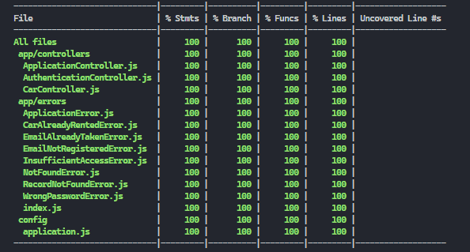

# Binar: Challenge 04

Welcome to my Binar Challenge chapter 5 about create Resful Api Using Express.js .

## Tech stack

- [`Node Js (v18.17.1)`](https://nodejs.org/en)

  > As an asynchronous event-driven JavaScript runtime, Node.js is designed to build scalable network applications. In the following "hello world" example, many connections can be handled concurrently. Upon each connection, the callback is fired, but if there is no work to be done, Node.js will sleep.

- [`Express Js (Web Server)`](https://expressjs.com/)

  > Express is a minimal and flexible Node.js web application framework that provides a robust set of features for web and mobile applications.

- [`Nodemon`](https://www.npmjs.com/package/nodemon)

  > nodemon is a tool that helps develop Node.js based applications by automatically restarting the node application when file changes in the directory are detected.

- [`Sequelize`](https://sequelize.org/)

  > Sequelize is a modern TypeScript and Node.js ORM for Oracle, Postgres, MySQL, MariaDB, SQLite and SQL Server, and more. Featuring solid transaction support, relations, eager and lazy loading, read replication and more.

- [`bcryptjs`](https://www.npmjs.com/package/bcryptjs)

  > Optimized bcrypt in JavaScript with zero dependencies. Compatible to the C++ bcrypt binding on node.js and also working in the browser.

- [`jsonwebtoken`](https://npmjs.com/package/jsonwebtoken)

  > JSON Web Token (JWT) is an open standard (RFC 7519) that defines a compact and self-contained way for securely transmitting information between parties as a JSON object. This information can be verified and trusted because it is digitally signed. JWTs can be signed using a secret (with the HMAC algorithm) or a public/private key pair using RSA or ECDSA.

- [`dotenv`](https://www.npmjs.com/package/dotenv)

  > Dotenv is a zero-dependency module that loads environment variables from a .env file into process.env. Storing configuration in the environment separate from code is based on The Twelve-Factor App methodology.

## Tools

- [`vsCode (Code Editor)`](https://code.visualstudio.com/)

  > Visual Studio Code is a code editor redefined and optimized for building and debugging modern web and cloud applications.

- [`GIT (Version Control)`](https://git-scm.com/)

  > Git is a free and open source distributed version control system designed to handle everything from small to very large projects with speed and efficiency.

## ERD



## Link Deploy

```
LINK: https://binar-challenge07-deploy-production.up.railway.app/v1/cars


note: code deployment in seperate repo
```
